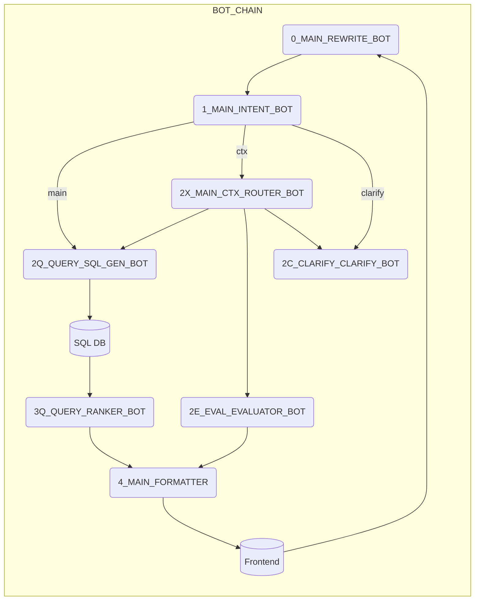

# 📚 CLAUDE Guide v2 – Working in CECI‑AI
a file called update_log.md has the latest updates on what we have done
> **Purpose** – Give Claude Code (claude.ai/code) the *minimal yet sufficient* context to work productively in this repo **without burning tokens**.
>
> **Rule #1** – *Read only the files you need for the task at hand.*  Each bot‑layer has its own spec – no reason to gulp the whole repo.

---

## 0. TL;DR Quick Start 🍸

| Action                    | Command / File                                                  |
| ------------------------- | --------------------------------------------------------------- |
| Spin up full stack (HTTP) | `docker compose up -d`                                          |
| Dev frontend              | `npm run dev` (root)                                            |
| Dev backend (Express)     | `cd server && npm run dev`                                      |
| Run **fast** tests        | `./tests/run_tests.sh`                                          |
| Run **full** tests        | `./tests/run_tests.sh -m comprehensive -v debug --full-content` |
| Check CI badge            | GitHub Actions → **Pipeline** workflow                          |

> **Remember**: *Green CI is the only passport to merge.*

---

## 1. System at 10 000 ft 🏔️

```
┌──────── Frontend (React) ───────┐
│  calls  POST /api/process-query │
└──────────────┬──────────────────┘
               ▼
┌────── Backend (Express) ────────┐
│ auth  ▼  cache (Redis)          │
└──────────────┬──────────────────┘
               ▼
┌────── BOT CHAIN (7 GPT bots) ───┐
│ 0_REWRITE → … → 3Q_RANK → 4_FMT │
└──────────────┬──────────────────┘
               ▼
      Supabase Postgres (24 716 decisions)
```

*Detailed per‑layer docs live in* `bot_chain/LAYERS_SPECS/`.

---

## 2. Directory Layout 📁

```
/               mono‑repo root
├─ src/         ← React frontend
├─ server/      ← Node + Express backend
├─ bot_chain/   ← GPT pipeline code & specs
│   ├─ LAYERS_SPECS/
│   └─ MICRO_LEVEL_GUIDE.md
├─ tests/       ← unified shell+pytest test harness
├─ .github/     ← CI workflows (matrix, lint, e2e, nightly)
└─ docker‑compose.yml (+ .prod.yml)
```

---

## 3. Development Recipes 🍳

### 3.1 Local env vars

Create `.env` (root) – sample in `.env.example`.

```
OPENAI_API_KEY=sk‑…
SUPABASE_URL=https://xyz.supabase.co
SUPABASE_SERVICE_KEY=…
BOT_CHAIN_PORT=8002
REDIS_URL=redis://localhost:6379
```

The docker compose file reads these automatically via `env_file:`.

### 3.2 Token sanity

Each layer receives a **hard budget** (see `ARCHITECTURE.md §8`).  The backend logs `token_usage` per request; Grafana panels alert when >80 %.

---

## 4. Testing & CI 🧪

| Scope         | Where                          | Trigger         |
| ------------- | ------------------------------ | --------------- |
| **Unit**      | `tests/<comp>`                 | PR push         |
| **Component** | layer‑specific golden sets     | PR push         |
| **E2E Quick** | `./tests/run_tests.sh` (quick) | PR push         |
| **E2E Full**  | nightly GH Action              | cron\@02:00 UTC |

*Results are dumped to* `tests/results.ndjson` *and, on CI, converted to JUnit → GH graphs*.

**❗Build → Test → Promote Gate** – The pipeline in `Pipeline Task Plan` enforces that every **‑T** job must pass before its sibling **‑B** successor unlocks (see CI `needs:` graph).

---

## 5. Common Gotchas ⚠️

1. **LRM (`\u200E`) ghosts** – remove invisible RTL markers; they break Bash.
2. **Supabase Row Security** – local dev DB has RLS off; in staging you must set `auth.jwt.claim` header.
3. **TypeScript paths** – Backend uses `ts‑config‑paths`. Run `npm run build` to verify.

---

## 6. Modifying a Bot Layer 🛠️

1. Open only `bot_chain/LAYERS_SPECS/<layer>.md` + maybe `MICRO_LEVEL_GUIDE.md`.
2. Adjust the prompt / code in `bot_chain/src/<layer>/`.
3. Add/extend tests in `tests/<layer>/`.
4. Run `./tests/run_tests.sh -m quick -j 4`. **Green?** Commit → PR.

*(No need to read other layer specs – saves tokens.)*

---

## 7. Deployment Checklist 🚀

| Step              | File / Command                                                          |
| ----------------- | ----------------------------------------------------------------------- |
| Provision droplet | `DIGITALOCEAN_DEPLOYMENT.md`                                            |
| SSL certs         | `./scripts/init‑letsencrypt.sh`                                         |
| Prod compose      | `docker compose -f docker-compose.yml -f docker-compose.prod.yml up -d` |
| Health ping       | `curl https://<domain>/api/health` = `200 OK`                           |

---

## 8. Quick Reference Matrix 📑

| Need                | Go to                                                              |
| ------------------- | ------------------------------------------------------------------ |
| Flow overview       | `bot_chain/ARCHITECTURE.md §2`                                     |
| Prompt edit         | `bot_chain/LAYERS_SPECS/<layer>.md`                                |
| SQL schema          | `bot_chain/LAYERS_SPECS/israeli_government_decisions_DB_SCHEME.md` |
| Manual Hebrew cases | `tests/manual_test_cases_hebrew.md`                                |
| Pipeline plan       | `Pipeline Task Plan` (canvas)                                      |

---

### 🏁 Now Build → Test → Promote → Win!


## 🧩 BOT-CHAIN · Micro-Level Implementation Guide

<small>Version 0.9 · June 27 2025</small>

> **תכלית** – מסמך מעשי שמרכז את כל השלבים, החוזים, מבנה התיקיות וה-DevOps הנחוצים להקמת רכיב `bot-chain`
> (ה־Core החדש שמחליף את `sql-engine`) – עם שמות השכבות המלאים.

---

### 1 · High-Level Architecture



---

### 2 · Updated Folder Tree

```text
bot-chain/
├── common/
│   ├── models.py
│   ├── logging.yaml
│   └── utils.py
├── 0_MAIN_REWRITE_BOT/
│   ├── main.py
│   └── Dockerfile
├── 1_MAIN_INTENT_BOT/
│   ├── main.py
│   └── Dockerfile
├── 2Q_QUERY_SQL_GEN_BOT/
│   ├── main.py
│   └── Dockerfile
├── 2X_MAIN_CTX_ROUTER_BOT/
│   ├── main.py
│   └── Dockerfile
├── 2E_EVAL_EVALUATOR_BOT/
│   ├── main.py
│   └── Dockerfile
├── 2C_CLARIFY_CLARIFY_BOT/
│   ├── main.py
│   └── Dockerfile
├── 3Q_QUERY_RANKER_BOT/
│   ├── main.py
│   └── Dockerfile
├── 4_MAIN_FORMATTER/
│   ├── main.py
│   └── Dockerfile
├── docker-compose.yml
├── tests/
│   ├── test_0_main_rewrite_bot.py
│   ├── test_1_main_intent_bot.py
│   ├── test_2q_query_sql_gen_bot.py
│   ├── test_2x_main_ctx_router_bot.py
│   ├── test_2e_eval_evaluator_bot.py
│   ├── test_2c_clarify_clarify_bot.py
│   ├── test_3q_query_ranker_bot.py
│   └── test_4_main_formatter.py
└── README.md
```

---

### 3 · Global Conventions

| Key                  | Value                                                                  |
| -------------------- | ---------------------------------------------------------------------- |
| **Message envelope** | NDJSON – every line = `{conv_id, trace_id, timestamp, layer, payload}` |
| **Trace header**     | `x-conversation-id`                                                    |
| **Event bus**        | Redis Streams `ceci_events`                                            |
| **OpenAI timeout**   | `30 s` per call, 3 retries (expo back-off)                             |
| **Health URL**       | `GET /health` → `{"status":"ok","layer":"<name>"}`                     |
| **Prometheus**       | `/metrics` with labels `layer`, `model`                                |

---

### 4 · Layer-by-Layer Specs

| 🏷️ Layer                      | Endpoint(s)      | Core Logic                                                                           | GPT Model       |
| ------------------------------ | ---------------- | ------------------------------------------------------------------------------------ | --------------- |
| **0\_MAIN\_REWRITE\_BOT**      | `POST /rewrite`  | Prompt-template “Improve Hebrew phrasing + normalize entities”, returns `clean_text` | `gpt-3.5-turbo` |
| **1\_MAIN\_INTENT\_BOT**       | `POST /intent`   | Extract `intent`, `entities`, route flags                                            | `gpt-4-turbo`   |
| **2Q\_QUERY\_SQL\_GEN\_BOT**   | `POST /sqlgen`   | Generate parameterized SQL, verify with `sqlparse`, fallback to templated query      | `gpt-4-turbo`   |
| **2X\_MAIN\_CTX\_ROUTER\_BOT** | `POST /context`  | Fetch last N turns from Redis, decide reuse / merge                                  | `gpt-3.5-turbo` |
| **2E\_EVAL\_EVALUATOR\_BOT**   | `POST /evaluate` | Weight scoring, SHAP explanation, anomaly flags                                      | `gpt-4-turbo`   |
| **2C\_CLARIFY\_CLARIFY\_BOT**  | `POST /clarify`  | Craft follow-up Q ≤ 200-chars                                                        | `gpt-3.5-turbo` |
| **3Q\_QUERY\_RANKER\_BOT**     | `POST /rank`     | BM25 + GPT rerank top 10 rows → `ranked`                                             | `gpt-3.5-turbo` |
| **4\_MAIN\_FORMATTER**         | `POST /format`   | Jinja2 template to final markdown / JSON, add “Full Decision Content” when requested | —               |

---

### 5 · API Contract (Excerpt)

```yaml
# openapi/bot-chain.yml
paths:
  /rewrite:
    post:
      summary: Clean & rewrite user text
      responses:
        "200":
          content:
            application/json:
              schema: { $ref: "#/components/schemas/ReWriteResponse" }

components:
  schemas:
    ReWriteResponse:
      type: object
      properties:
        conv_id: { type: string, format: uuid }
        clean_text: { type: string }
```

(חוזים דומים לכל שכבה - בקבצי YAML נפרדים או מקטעים שונים באותו קובץ.)

---

### 6 · Development Workflow

1. **Contracts-first**
   *Generate pydantic models from OpenAPI → `common/models.py`.*

2. **Layer implementation order**
   `0_MAIN_REWRITE_BOT` → `1_MAIN_INTENT_BOT` → `2Q_QUERY_SQL_GEN_BOT` … → `4_MAIN_FORMATTER`.

3. **Local run**

   ```bash
   docker compose -f docker-compose.yml up -d --build
   curl -X POST http://localhost:8002/rewrite -d '{"text":"..."}'
   ```

4. **Unit tests**

   ```bash
   pytest -q --cov=. tests/
   ```

5. **CI (GitHub Actions)**
   *On PR:* Build all images → `docker compose -f docker-compose.test.yml up` → fail fast.

6. **Blue-green deploy**

   ```bash
   docker compose --profile new-core up -d \
     && ./scripts/smoke.sh \
     || ./scripts/rollback_core.sh
   ```

---

### 7 · Observability & Ops

| Metric                | Source     | Alert Rule            |
| --------------------- | ---------- | --------------------- |
| p95 latency per layer | Prometheus | > 2 s for 5 m         |
| OpenAI error rate     | Prometheus | > 5 %                 |
| Redis stream lag      | Grafana    | > 1 s                 |
| Healthcheck fail      | Watchtower | immediate email/Slack |

---

### 8 · Edge-Case Test Matrix

| Case                    | Expected Behaviour                                  | Critical Layer           |
| ----------------------- | --------------------------------------------------- | ------------------------ |
| Ambiguous question      | Trigger 2C\_CLARIFY\_CLARIFY\_BOT                   | `1_MAIN_INTENT_BOT`      |
| No DB results           | `4_MAIN_FORMATTER` returns “לא נמצאו תוצאות”        | `3Q_QUERY_RANKER_BOT`    |
| Follow-up with pronouns | Context router resolves entities                    | `2X_MAIN_CTX_ROUTER_BOT` |
| Request full content    | Formatter appends **Full Decision Content** section | `2Q_QUERY_SQL_GEN_BOT`   |

---


