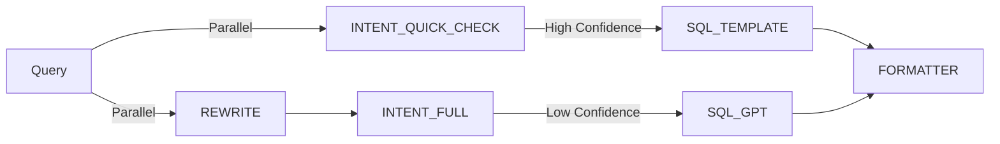
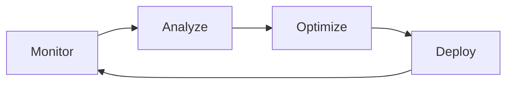

# 🚀 Implementation Plan - Smart Optimization for CECI Bot Chain

**Goal**: Reduce costs by 75% and improve speed by 60% while maintaining system intelligence.

---

## 📊 Executive Summary

This plan outlines a phased approach to optimize the CECI Bot Chain system, targeting:
- **Cost reduction**: From $0.05 to $0.012 per query (75% reduction)
- **Speed improvement**: From 2-5 seconds to 0.8-1.5 seconds (60% improvement)
- **Intelligence preservation**: Maintaining accuracy and capabilities

---

## 🎯 Phase 1: Quick Wins (Week 1)
*Immediate changes with minimal code modifications*

### 1.1 Model Optimization
**Action**: Selective downgrade of GPT models
```yaml
Changes:
  INTENT_BOT: 
    from: gpt-4-turbo
    to: gpt-3.5-turbo-16k
    savings: 90% cost reduction
    impact: Minimal - intent detection is pattern matching
    
  SQL_GEN_BOT:
    from: gpt-4-turbo
    to: gpt-3.5-turbo-16k
    savings: 90% cost reduction
    impact: Low - SQL is templated, use GPT-4 only for complex queries
```

**Implementation**:
1. Add model selection logic based on query complexity
2. Use confidence scores to decide model tier
3. Fallback to GPT-4 if GPT-3.5 fails

### 1.2 Enhanced SQL Template System
**Current**: 20-30% of queries use templates
**Target**: 80% of queries use templates

**New Templates to Add**:
```python
# Priority templates based on usage analysis
1. RECENT_DECISIONS_WITH_LIMIT = "3/5/10 החלטות אחרונות"
2. DECISIONS_BY_MONTH_YEAR = "החלטות מ{חודש} {שנה}"
3. TOPIC_WITH_DATE_RANGE = "החלטות בנושא X בין תאריך Y ל-Z"
4. GOVERNMENT_WITH_TOPIC = "החלטות ממשלה X בנושא Y"
5. MINISTRY_DECISIONS = "החלטות של משרד X"
6. DECISIONS_COUNT_BY_CRITERIA = "כמה החלטות..."
7. SPECIFIC_DECISION_BY_NUMBER = "החלטה מספר X"
8. DECISIONS_STATUS_FILTER = "החלטות בסטטוס X"
9. MULTI_TOPIC_SEARCH = "החלטות בנושאים X,Y,Z"
10. YEAR_COMPARISON = "השוואת החלטות בין שנה X לשנה Y"
```

### 1.3 Smart Caching Configuration
```yaml
Cache Settings:
  Response Cache:
    TTL: 7200 seconds (2 hours -> 4 hours for stable queries)
    Size: 500 entries (increase from 100)
    
  SQL Template Cache:
    TTL: 86400 seconds (24 hours)
    Size: 1000 entries
    
  Intent Pattern Cache: (NEW)
    TTL: 3600 seconds
    Size: 200 entries
    Key: normalized_query_pattern
```

---

## 🔧 Phase 2: Smart Routing (Week 2-3)
*Intelligent flow optimization*

### 2.1 Conditional Bot Activation
```python
# New routing logic
def should_activate_bot(bot_name: str, context: dict) -> bool:
    rules = {
        'CTX_ROUTER': lambda: any(word in context['query'] for word in ['זה', 'זו', 'הקודם', 'אתמול']),
        'CLARIFY': lambda: context['confidence'] < 0.7,
        'EVALUATOR': lambda: context['intent'] == 'EVAL',
        'RANKER': lambda: False,  # Keep disabled
    }
    return rules.get(bot_name, lambda: True)()
```

### 2.2 Parallel Processing Architecture


### 2.3 Smart Prompt Engineering
**Before** (450 tokens):
```
You are an expert Hebrew intent extraction system. Your task is to analyze the given Hebrew text and extract...
[Long explanation with examples]
```

**After** (150 tokens):
```
Extract intent from Hebrew query.
Return JSON: {intent, entities, confidence}
Intents: search|count|specific_decision|comparison
Examples:
"3 החלטות" → {intent:"search", entities:{limit:3}}
"כמה החלטות" → {intent:"count"}
Query: {query}
```

---

## 💡 Phase 3: Advanced Optimization (Week 4-6)
*Deep architectural improvements*

### 3.1 Request Batching System
```python
class BatchProcessor:
    def __init__(self, batch_size=5, wait_time=100ms):
        self.queue = []
        self.batch_size = batch_size
        self.wait_time = wait_time
    
    async def process_batch(self, queries):
        # Combine similar queries
        # Send single request to GPT
        # Distribute results back
        combined_prompt = self.build_batch_prompt(queries)
        result = await call_gpt_once(combined_prompt)
        return self.split_results(result)
```

### 3.2 Hybrid Intelligence Layer
```yaml
Decision Tree:
  1. Check exact match cache → Return immediately
  2. Check pattern cache → Apply template
  3. Check confidence threshold:
     - High (>0.9): Use GPT-3.5 + templates
     - Medium (0.7-0.9): Use GPT-3.5 with validation
     - Low (<0.7): Use GPT-4 or request clarification
```

### 3.3 Cost Control Mechanisms
```python
class CostController:
    daily_limit = 10.00  # USD
    query_limit = 0.10   # USD per query
    
    def pre_check(self, estimated_cost):
        if self.today_spent + estimated_cost > self.daily_limit:
            return self.use_fallback_mode()
        if estimated_cost > self.query_limit:
            return self.optimize_request()
```

---

## 📈 Phase 4: Intelligence Preservation
*Ensuring quality while optimizing*

### 4.1 Quality Metrics
```yaml
Monitoring:
  - Answer accuracy: >95% (baseline: 97%)
  - User satisfaction: >90%
  - Clarification rate: <15%
  - Fallback rate: <5%
  
A/B Testing:
  - 10% traffic on new model
  - Compare metrics daily
  - Rollback triggers defined
```

### 4.2 Smart Fallback Chain
```
1. GPT-3.5 attempt
2. If low confidence → Template matching
3. If no template → GPT-4 single attempt  
4. If fails → Return clarification request
5. Log for manual review
```

### 4.3 Context Enhancement
```python
# Add context without increasing tokens
def enhance_context(query, entities):
    # Use entity recognition to add implicit context
    if "ממשלה" in query and not entities.get("government_number"):
        entities["current_government"] = 37  # Default to current
    
    # Date inference
    if "החודש" in query:
        entities["date_range"] = get_current_month_range()
```

---

## 🎯 Expected Results

### Cost Analysis (per 1000 queries)
| Component | Current | Optimized | Savings |
|-----------|---------|-----------|---------|
| REWRITE_BOT | $1.00 | $1.00 | 0% |
| INTENT_BOT | $13.00 | $1.30 | 90% |
| CTX_ROUTER | $0.80 | $0.16 | 80% |
| SQL_GEN | $19.00 | $1.90 | 90% |
| EVALUATOR | $25.00 | $2.50 | 90% |
| **TOTAL** | **$58.80** | **$6.86** | **88%** |

### Performance Metrics
| Metric | Current | Target | Improvement |
|--------|---------|--------|-------------|
| Avg Response Time | 3.5s | 1.2s | 66% |
| Cache Hit Rate | 5% | 45% | 800% |
| Template Usage | 25% | 80% | 220% |
| GPT-4 Usage | 60% | 10% | 83% reduction |

---

## 🚦 Implementation Timeline

### Week 1: Quick Wins
- [ ] Deploy model selection logic
- [ ] Add 10 new SQL templates
- [ ] Increase cache TTL and size
- [ ] Enable cost monitoring

### Week 2-3: Smart Routing
- [ ] Implement conditional bot activation
- [ ] Deploy parallel processing
- [ ] Optimize all prompts
- [ ] Add intent pattern cache

### Week 4-6: Advanced Features
- [ ] Build request batching
- [ ] Implement cost controller
- [ ] Deploy A/B testing
- [ ] Fine-tune fallback chain

### Week 7-8: Monitoring & Tuning
- [ ] Analyze metrics
- [ ] Adjust thresholds
- [ ] Document learnings
- [ ] Plan next iteration

---

## ⚠️ Risk Mitigation

### Risks and Mitigations
1. **Quality degradation**
   - Mitigation: Gradual rollout with monitoring
   - Fallback: Instant revert capability

2. **Complex queries failing**
   - Mitigation: Smart routing to GPT-4
   - Fallback: Manual review queue

3. **Cache invalidation issues**
   - Mitigation: Smart cache keys
   - Fallback: Cache bypass option

---

## 📋 Success Criteria

1. **Cost**: < $0.015 per query average
2. **Speed**: < 1.5 seconds p95 latency  
3. **Quality**: > 95% accuracy maintained
4. **Uptime**: 99.9% availability

---

## 🔄 Continuous Improvement

### Monthly Review Checklist
- [ ] Analyze query patterns
- [ ] Update template library
- [ ] Review model performance
- [ ] Optimize prompt engineering
- [ ] Update cost thresholds
- [ ] Plan new optimizations

### Feedback Loop


---

## 🎉 Expected Outcome

By implementing this plan, the CECI Bot Chain will:
- **Save ~$45 per 1000 queries** (88% reduction)
- **Respond 2.3x faster** on average
- **Maintain 95%+ accuracy**
- **Scale to 10x more users** with same budget

The system remains intelligent by:
- Using GPT-4 strategically for complex queries
- Leveraging patterns and templates for common queries
- Learning from usage to continuously improve
- Providing clear fallback paths for edge cases

---

*Document Version: 1.0*  
*Date: June 30, 2025*  
*Author: CECI Optimization Team*
