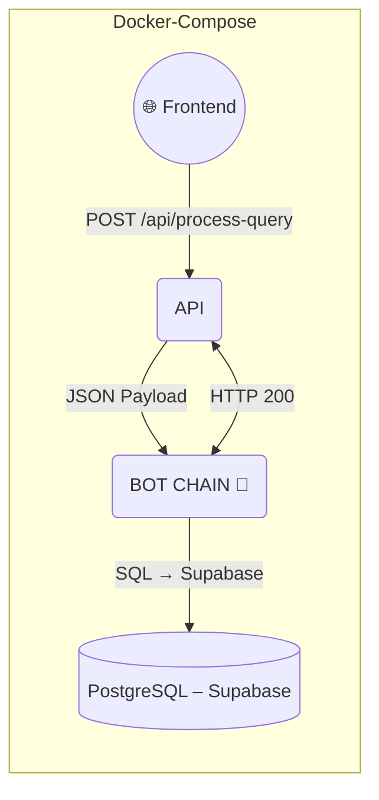

# 📐 ARCHITECTURE – BOT CHAIN (2025 Edition)

> **TL;DR (EN)** — *We replaced `sql-engine` with a drop‑in **BOT CHAIN** container. Same REST contract, same port. Seven GPT‑powered bots run in‑process; a lightweight Formatter **code module** (not a bot) renders the final answer.*

> **תקציר (עברית)** — קונטיינר **SQL ENGINE** הוחלף ב‑**BOT CHAIN** יחיד, החוזה נשאר זהה (אותו פורט, אותו נתיב). בתוך הקונטיינר רצות **7 שכבות‑בוט**; בסוף מודול קוד "Formatter" מארגן את המידע בפורמט מוסכם מראש.

---

## 1 · High‑Level Topology



* **Same port** → `BOT_CHAIN_PORT = 8002`.
* **Single container** → orchestration of **7 bots** happens in‑process.

---

## 2 · Runtime Flow (bird’s‑eye)

| # | Component                 | In → Out                  | Comment                   |
| - | ------------------------- | ------------------------- | ------------------------- |
| ① | **0\_REWRITE\_BOT**       | Raw text → Rewritten      | Grammar & clarity         |
| ② | **1\_INTENT\_BOT**        | Rewritten → Intent‑schema | Detect user goal          |
| ③ | **2X\_CTX\_ROUTER\_BOT**  | Intent → Routed ctx       | Map convo state           |
| ④ | **2C\_CLARIFY\_BOT**      | (conditional)             | Ask follow‑up if fuzzy    |
| ⑤ | **2Q\_SQL\_GEN\_BOT**     | Params → SQL              | Generate parametrised SQL |
| ⑥ | **SQL Runner (internal)** | SQL → Rows                | Query Supabase            |
| ⑦ | **2E\_EVALUATOR\_BOT**    | Rows → Scored             | Qualitative filter        |
| ⑧ | **3Q\_RANKER\_BOT**       | Scored → Ranked           | Quant ranking             |
| ⑨ | **Formatter (code)**      | Ranked → Markdown/JSON    | NOT a bot                 |

▶ Full layer specs: `bot_chain/LAYERS_SPECS/`.

---

## 3 · GPT Model Matrix

| 🔢 שלב       | 📛 שם שכבה           | ⚙️ מודל GPT מומלץ (≤5 מילים) |
| ------------ | -------------------- | ---------------------------- |
| `0_MAIN`     | `0_REWRITE_BOT`      | `gpt‑3.5‑turbo` — ניסוח מהיר |
| `1_MAIN`     | `1_INTENT_BOT`       | `gpt‑4‑turbo` — הבנת הקשר    |
| `2X_MAIN`    | `2X_CTX_ROUTER_BOT`  | `gpt‑3.5‑turbo` — Routing קל |
| `2C_CLARIFY` | `2C_CLARIFY_BOT`     | `gpt‑3.5‑turbo` — שאלה חדה   |
| `2Q_QUERY`   | `2Q_SQL_GEN_BOT`     | `gpt‑4‑turbo` — דיוק SQL     |
| `2E_EVAL`    | `2E_EVALUATOR_BOT`   | `gpt‑4‑turbo` — ניתוח איכותי |
| `3Q_RANK`    | `3Q_RANKER_BOT`      | `gpt‑3.5‑turbo` — דירוג זריז |
| **N/A**      | **Formatter (code)** | ❌ No GPT                     |

---

## 4 · REST Contract (unchanged)

```http
POST /api/process-query HTTP/1.1
Content-Type: application/json

{
  "query": "string – user text",
  "conversation_id": "uuid",
  "metadata": {}
}
```

**Response 200**

```json
{
  "answer_markdown": "…",
  "follow_up": ["…"],
  "debug_info": {}
}
```

---

## 5 · Deployment Snippet

```yaml
services:
  bot-chain:
    image: ghcr.io/org/bot-chain:latest
    ports:
      - "8002:8002"
    env_file:
      - .env
    restart: unless-stopped
```

**ENV Vars** (unchanged): `OPENAI_API_KEY`, `BOT_CHAIN_PORT`, `SUPABASE_URL`, `SUPABASE_KEY`.

---

## 6 · Database

* **No schema changes** — see `israeli_government_decisions_DB_SCHEME.md`.
* Bots access data via Supabase REST.

---

## 7 · Observability (⏸ future)

`/metrics` endpoint will be re‑enabled later. Health‑check active.

---

## 8 · Token Budget Reference (Testing Phase)

> הערכות גסות (±20%) המבוססות על בדיקות ידניות. יקל על חישוב עלות ו‑rate‑limit בזמן QA.

| Bot Layer                       | Avg Prompt tokens | Avg Completion tokens | Total (per call) |
| ------------------------------- | ----------------- | --------------------- | ---------------- |
| `0_REWRITE_BOT`                 | \~50              | \~50                  | **100**          |
| `1_INTENT_BOT`                  | \~80              | \~50                  | **130**          |
| `2X_CTX_ROUTER_BOT`             | \~50              | \~30                  | **80**           |
| `2C_CLARIFY_BOT` *(if invoked)* | \~60              | \~60                  | **120**          |
| `2Q_SQL_GEN_BOT`                | \~120             | \~70                  | **190**          |
| `2E_EVALUATOR_BOT`              | \~150             | \~100                 | **250**          |
| `3Q_RANKER_BOT`                 | \~100             | \~60                  | **160**          |
| **Formatter (code)**            | 0                 | 0                     | **0**            |

**End‑to‑End Scenario (no clarify)** → **≈ 910 tokens**.
With clarification step → **≈ 1,030 tokens**.

> 💰 *Cost rough‑calc*: 1K tokens ≈ \$0.01 on gpt‑3.5‑turbo, ≈ \$0.03 on gpt‑4‑turbo (June 2025 rates). Mixed path ≈ \$0.02 per full query.

These numbers will be logged in `debug_info.token_usage` for every QA run.

---

## 9 · Further Reading

* `bot_chain/LAYERS_SPECS/*` — full prompts & weights
* `MICRO_LEVEL_GUIDE.md` — layer deep dive
* `end2End_scenarios.md` — QA flows

---

## 10 · Changelog

| Date       | Change                     |
| ---------- | -------------------------- |
| 2025‑06‑27 | Initial BOT CHAIN edition  |
| 2025‑06‑27 | 7 bots + Formatter code    |
| 2025‑06‑27 | Added token budget section |
