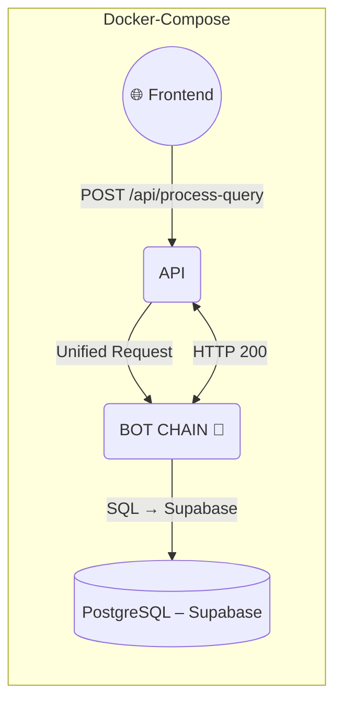

# 📐 ARCHITECTURE – BOT CHAIN (2025 Unified Edition)

> **TL;DR (EN)** — *Unified GPT-4o architecture: Entry point is now a single **1_INTENT_BOT** (GPT-4o-turbo) combining text normalization + intent detection. Exit point is **4_FORMATTER_BOT** (GPT-4o-mini) for flexible Hebrew formatting.*

> **תקציר (עברית)** — ארכיטקטורה מאוחדת: נקודת כניסה היא **1_INTENT_BOT** יחיד (GPT-4o-turbo) המשלב נרמול טקסט + זיהוי כוונה. נקודת יציאה היא **4_FORMATTER_BOT** (GPT-4o-mini) לעיצוב גמיש בעברית.

---

## 🆕 Architecture Update (July 2025)

### What Changed?
- **MERGED**: `0_REWRITE_BOT` + `1_INTENT_BOT` → Single **`1_INTENT_BOT`** (GPT-4o-turbo)
- **UPGRADED**: `Formatter (code)` → **`4_FORMATTER_BOT`** (GPT-4o-mini LLM)
- **PRESERVED**: All other bots remain unchanged

### Why?
- **Performance**: Save 200-300ms (one less API call)
- **Quality**: GPT-4o handles Hebrew nuances better than GPT-3.5 + JS
- **Flexibility**: LLM formatter handles edge cases (plural-gender agreement)
- **Budget**: Restored budget allows GPT-4o on critical layers

---

## 1 · High‑Level Topology



* **Entry**: Single unified intent detection
* **Exit**: LLM-based formatting

---

## 2 · Runtime Flow (Updated)

| # | Component                 | In → Out                  | Model            | Comment                   |
| - | ------------------------- | ------------------------- | ---------------- | ------------------------- |
| ① | **1\_INTENT\_BOT** 🆕     | Raw text → Clean + Intent | **gpt-4o-turbo** | Unified entry point       |
| ② | **2X\_CTX\_ROUTER\_BOT**  | Intent → Routed ctx       | gpt-3.5-turbo    | Context management        |
| ③ | **2C\_CLARIFY\_BOT**      | (conditional)             | gpt-3.5-turbo    | Clarification if needed   |
| ④ | **2Q\_SQL\_GEN\_BOT**     | Params → SQL              | gpt-4o-turbo     | SQL generation            |
| ⑤ | **SQL Runner (internal)** | SQL → Rows                | —                | Query Supabase            |
| ⑥ | **2E\_EVALUATOR\_BOT**    | Rows → Analysis           | gpt-4o-turbo     | Deep analysis (EVAL only) |
| ⑦ | **3A\_RANKER\_BOT**       | Rows → Ranked             | gpt-3.5-turbo    | Result ranking            |
| ⑧ | **4\_FORMATTER\_BOT** 🆕  | Data → Markdown           | **gpt-4o-mini**  | LLM formatting            |

---

## 3 · GPT Model Matrix (Updated)

| 🔢 Layer      | 📛 Name                  | ⚙️ Model              | 💰 Cost/1K | Purpose                  |
| ------------- | ------------------------ | --------------------- | ---------- | ------------------------ |
| `1_INTENT`    | `UNIFIED_INTENT_BOT`     | **gpt-4o-turbo** 🆕   | $0.03      | Hebrew NLP + Intent      |
| `2X_ROUTER`   | `CTX_ROUTER_BOT`         | gpt-3.5-turbo         | $0.0015    | Light routing            |
| `2C_CLARIFY`  | `CLARIFY_BOT`            | gpt-3.5-turbo         | $0.0015    | Quick questions          |
| `2Q_SQL`      | `SQL_GEN_BOT`            | gpt-4o-turbo          | $0.03      | Precise SQL              |
| `2E_EVAL`     | `EVALUATOR_BOT`          | gpt-4o-turbo          | $0.03      | Deep analysis            |
| `3A_RANK`     | `RANKER_BOT`             | gpt-3.5-turbo         | $0.0015    | Fast ranking             |
| `4_FORMAT`    | `LLM_FORMATTER_BOT`      | **gpt-4o-mini** 🆕    | $0.0002    | Flexible formatting      |

---

## 4 · Data Flow Examples

### QUERY Flow (Search)
```
User: "5 החלטות אחרונות בנושא חינוך"
  ↓
1_INTENT_BOT → {clean_query: "5 החלטות אחרונות בנושא חינוך", 
                intent: "DATA_QUERY", 
                params: {limit: 5, topic: "חינוך"}}
  ↓
2X_ROUTER → 2Q_SQL_GEN → Supabase → 3A_RANKER
  ↓
4_FORMATTER_BOT → Beautiful Hebrew cards
```

### EVAL Flow (Analysis)
```
User: "נתח לעומק את החלטה 2983"
  ↓
1_INTENT_BOT → {clean_query: "ניתוח מעמיק של החלטה 2983",
                intent: "ANALYSIS",
                params: {decision_number: 2983}}
  ↓
2X_ROUTER → 2Q_SQL_GEN → Supabase → 2E_EVALUATOR
  ↓
4_FORMATTER_BOT → Comprehensive analysis report
```

---

## 5 · API Contracts

### 1_INTENT_BOT (New Unified Contract)
**Input**:
```json
{
  "raw_user_text": "החלתה 2983 ממשלת 37",
  "chat_history": [...],
  "conv_id": "uuid"
}
```

**Output**:
```json
{
  "clean_query": "החלטה 2983 של ממשלה 37",
  "intent": "DATA_QUERY",
  "params": {
    "decision_number": 2983,
    "government_number": 37
  },
  "confidence": 0.95,
  "route_flags": {
    "needs_context": false,
    "is_statistical": false
  },
  "corrections": [
    {"type": "spelling", "original": "החלתה", "corrected": "החלטה"}
  ],
  "token_usage": {
    "total_tokens": 330,
    "model": "gpt-4o-turbo"
  }
}
```

### 4_FORMATTER_BOT (New LLM Contract)
**Input**:
```json
{
  "data_type": "ranked_rows|analysis|count|comparison",
  "content": {...},
  "original_query": "...",
  "presentation_style": "card|brief|detailed",
  "conv_id": "uuid"
}
```

**Output**:
```json
{
  "formatted_response": "# 🔍 תוצאות חיפוש\n\n## 1. החלטה...",
  "metadata": {
    "cards_generated": 3,
    "format_type": "decision_cards"
  },
  "token_usage": {
    "total_tokens": 350,
    "model": "gpt-4o-mini"
  }
}
```

---

## 6 · Migration & Rollout

### Feature Flags
```bash
USE_UNIFIED_INTENT=true  # Enable new 1_INTENT_BOT
USE_LLM_FORMATTER=true   # Enable new 4_FORMATTER_BOT
```

### Gradual Rollout
1. **10%** traffic → Monitor quality & latency
2. **25%** traffic → Check token usage
3. **50%** traffic → Validate cost projections
4. **100%** traffic → Full migration

### Rollback Plan
- Feature flags allow instant rollback
- Old bots remain available until validation complete
- Parallel monitoring of both flows

---

## 7 · Performance Metrics

### Before (Old Architecture)
- **Latency**: Rewrite (300ms) + Intent (200ms) = 500ms entry
- **Tokens**: ~100 (Rewrite) + 0 (JS Intent) = 100 tokens
- **Quality**: Mediocre Hebrew handling, rigid intent detection

### After (New Architecture)
- **Latency**: Unified Intent (300ms) = 300ms entry (-40%)
- **Tokens**: ~330 (Unified) = 330 tokens (+230%)
- **Quality**: Superior Hebrew handling, flexible detection

### Cost Analysis
- **Per Query**: $0.0003 → $0.0103 (+$0.01)
- **Daily (1K queries)**: $0.30 → $10.30
- **Acceptable**: Quality improvement justifies cost

---

## 8 · Token Budget (Updated)

| Bot Layer             | Avg Tokens | Model         | Cost/Query |
| --------------------- | ---------- | ------------- | ---------- |
| `1_INTENT_BOT` 🆕     | 330        | gpt-4o-turbo  | $0.0099    |
| `2X_CTX_ROUTER_BOT`   | 80         | gpt-3.5-turbo | $0.0001    |
| `2C_CLARIFY_BOT`      | 120        | gpt-3.5-turbo | $0.0002    |
| `2Q_SQL_GEN_BOT`      | 190        | gpt-4o-turbo  | $0.0057    |
| `2E_EVALUATOR_BOT`    | 500        | gpt-4o-turbo  | $0.0150    |
| `3A_RANKER_BOT`       | 160        | gpt-3.5-turbo | $0.0002    |
| `4_FORMATTER_BOT` 🆕  | 350        | gpt-4o-mini   | $0.0004    |

**Typical Query**: ~680 tokens ≈ $0.016
**Analysis Query**: ~1180 tokens ≈ $0.031

---

## 9 · Monitoring & Observability

### New Metrics
- `unified_intent_latency_ms` - Track new bot performance
- `unified_intent_accuracy` - Intent classification accuracy
- `formatter_quality_score` - Human evaluation of output
- `token_usage_by_model` - Cost tracking per model

### Alerts
- Latency > 500ms (p95)
- Daily spend > $50
- Intent accuracy < 98%
- Format quality < 4.5/5

---

## 10 · Further Reading

* `UNIFIED_INTENT_BOT_1/` — New unified bot implementation
* `LLM_FORMATTER_BOT_4/` — New formatter implementation
* `MICRO_LEVEL_GUIDE.md` — Updated coding principles
* `MIGRATION_GUIDE.md` — Step-by-step migration

---

## Changelog

| Date       | Change                                   |
| ---------- | ---------------------------------------- |
| 2025-06-27 | Initial 7-bot architecture               |
| 2025-07-07 | Unified GPT-4o architecture implemented  |
| 2025-07-07 | LLM formatter added                      |
| 2025-07-07 | Migration to new branch started          |