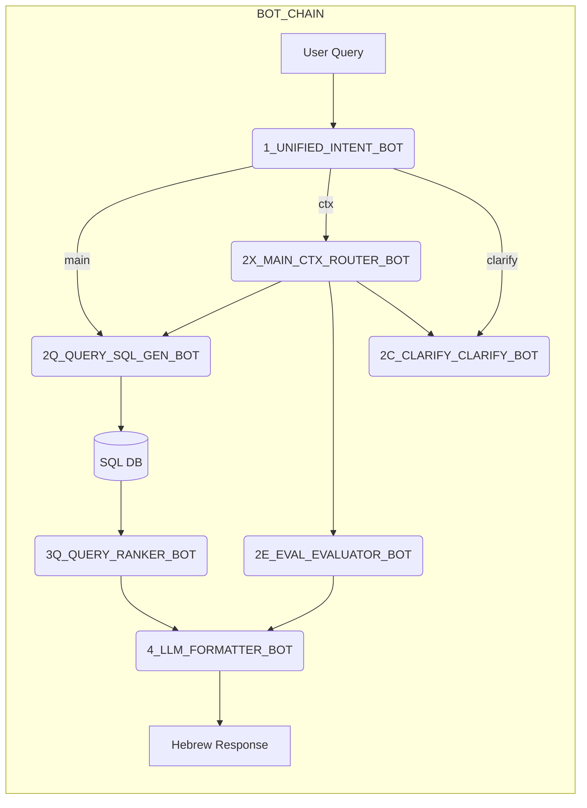

## 🧩 BOT-CHAIN · Micro-Level Implementation Guide

<small>Version 1.0 · July 7 2025 - Unified Architecture</small>

> **תכלית** – מסמך מעשי שמרכז את כל השלבים, החוזים, מבנה התיקיות וה-DevOps הנחוצים להקמת רכיב `bot-chain`
> עם הארכיטקטורה המאוחדת החדשה - **1_INTENT_BOT** (GPT-4o) ו-**4_FORMATTER_BOT** (GPT-4o-mini).

---

### 1 · High-Level Architecture (Unified)



**Key Changes:**
- **REMOVED**: `0_MAIN_REWRITE_BOT` (merged into Intent)
- **UNIFIED**: `1_UNIFIED_INTENT_BOT` (GPT-4o-turbo) handles both rewrite + intent
- **UPGRADED**: `4_LLM_FORMATTER_BOT` (GPT-4o-mini) for flexible formatting

---

### 2 · Updated Folder Tree

```text
bot-chain/
├── common/
│   ├── models.py
│   ├── logging.py
│   ├── config.py
│   └── __init__.py
├── UNIFIED_INTENT_BOT_1/        # 🆕 Merged rewrite + intent
│   ├── main.py
│   ├── requirements.txt
│   ├── Dockerfile
│   └── test_unified_intent.py
├── QUERY_SQL_GEN_BOT_2Q/
│   ├── main.py
│   ├── sql_templates.py
│   └── Dockerfile
├── MAIN_CTX_ROUTER_BOT_2X/
│   ├── main.py
│   └── Dockerfile
├── CLARIFY_CLARIFY_BOT_2C/
│   ├── main.py
│   └── Dockerfile
├── EVAL_EVALUATOR_BOT_2E/
│   ├── main.py
│   └── Dockerfile
├── QUERY_RANKER_BOT_3Q/
│   ├── main.py
│   └── Dockerfile
├── LLM_FORMATTER_BOT_4/         # 🆕 LLM-based formatter
│   ├── main.py
│   ├── requirements.txt
│   ├── Dockerfile
│   └── test_llm_formatter.py
├── docker-compose.yml
├── docker-compose.new-bots.yml  # 🆕 New bots config
└── openapi/
    └── bot-chain.yml
```

---

### 3 · Shared Conventions

| Convention           | Value                                                                  |
| -------------------- | ---------------------------------------------------------------------- |
| **Port range**       | `8010–8017` (8011 for Intent, 8017 for Formatter)                     |
| **Request timeout**  | Default `30s`, Evaluator `120s`                                        |
| **Response format**  | Always JSON: `{"conv_id": "...", "data": {...}, "timestamp": "..."}`  |
| **Trace header**     | `x-conversation-id`                                                    |
| **Event bus**        | Redis Streams `ceci_events`                                            |
| **OpenAI timeout**   | `30 s` per call, 3 retries (expo back-off)                             |
| **Health URL**       | `GET /health` → `{"status":"ok","layer":"<name>","model":"<model>"}`   |
| **Prometheus**       | `/metrics` with labels `layer`, `model`                                |

---

### 4 · Layer-by-Layer Specs (Updated)

| 🏷️ Layer                      | Endpoint(s)      | Core Logic                                                                           | GPT Model           |
| ------------------------------ | ---------------- | ------------------------------------------------------------------------------------ | ------------------- |
| **1\_UNIFIED\_INTENT\_BOT** 🆕  | `POST /intent`   | Normalize Hebrew + Extract `intent`, `entities`, route flags in one call              | **`gpt-4o-turbo`**  |
| **2Q\_QUERY\_SQL\_GEN\_BOT**   | `POST /sqlgen`   | Generate parameterized SQL, verify with `sqlparse`, fallback to templated query      | `gpt-4o-turbo`      |
| **2X\_MAIN\_CTX\_ROUTER\_BOT** | `POST /context`  | Fetch last N turns from Redis, decide reuse / merge                                  | `gpt-3.5-turbo`     |
| **2E\_EVAL\_EVALUATOR\_BOT**   | `POST /evaluate` | Weight scoring, SHAP explanation, anomaly flags                                      | `gpt-4o-turbo`      |
| **2C\_CLARIFY\_CLARIFY\_BOT**  | `POST /clarify`  | Craft follow-up Q ≤ 200-chars                                                        | `gpt-3.5-turbo`     |
| **3Q\_QUERY\_RANKER\_BOT**     | `POST /rank`     | BM25 + GPT rerank top 10 rows → `ranked`                                             | `gpt-3.5-turbo`     |
| **4\_LLM\_FORMATTER\_BOT** 🆕   | `POST /format`   | LLM-based formatting with Hebrew linguistic awareness                                 | **`gpt-4o-mini`**   |

---

### 5 · API Contract (Updated)

```yaml
# openapi/bot-chain.yml
paths:
  /intent:  # Unified endpoint
    post:
      summary: Process Hebrew query - normalize + detect intent
      requestBody:
        content:
          application/json:
            schema:
              type: object
              properties:
                raw_user_text: { type: string }
                chat_history: { type: array, items: { type: object } }
                conv_id: { type: string, format: uuid }
      responses:
        "200":
          content:
            application/json:
              schema: { $ref: "#/components/schemas/UnifiedIntentResponse" }

  /format:  # LLM formatter
    post:
      summary: Format results using LLM
      requestBody:
        content:
          application/json:
            schema:
              type: object
              properties:
                data_type: { type: string, enum: [ranked_rows, analysis, count, comparison] }
                content: { type: object }
                original_query: { type: string }
                presentation_style: { type: string, enum: [card, brief, detailed] }
                conv_id: { type: string, format: uuid }

components:
  schemas:
    UnifiedIntentResponse:
      type: object
      properties:
        conv_id: { type: string, format: uuid }
        clean_query: { type: string }
        intent: { type: string, enum: [DATA_QUERY, ANALYSIS, RESULT_REF, UNCLEAR] }
        params: { type: object }
        confidence: { type: number, minimum: 0, maximum: 1 }
        corrections: { type: array, items: { $ref: "#/components/schemas/Correction" } }
        token_usage: { $ref: "#/components/schemas/TokenUsage" }
```

---

### 6 · Development Workflow (Updated)

1. **Contracts-first**
   *Generate pydantic models from OpenAPI → `common/models.py`.*

2. **Layer implementation order**
   `1_UNIFIED_INTENT_BOT` → `2Q_QUERY_SQL_GEN_BOT` → ... → `4_LLM_FORMATTER_BOT`.
   
3. **Migration strategy**
   - Use feature flags: `USE_UNIFIED_INTENT=true`, `USE_LLM_FORMATTER=true`
   - Run both flows in parallel for A/B testing
   - Monitor quality metrics before full switch

4. **Local run**

   ```bash
   # Start new architecture
   docker compose -f docker-compose.new-bots.yml up -d
   
   # Test unified intent
   curl -X POST http://localhost:8011/intent \
     -H "Content-Type: application/json" \
     -d '{"raw_user_text":"החלתה 2983 ממשלת 37", "conv_id":"test-123"}'
   ```

5. **Unit tests**

   ```bash
   # Test unified intent bot
   python bot_chain/UNIFIED_INTENT_BOT_1/test_unified_intent.py
   
   # Test LLM formatter
   python bot_chain/LLM_FORMATTER_BOT_4/test_llm_formatter.py
   ```

6. **A/B Testing**

   ```bash
   # Enable for 10% of traffic
   export USE_UNIFIED_INTENT=true
   export UNIFIED_INTENT_ROLLOUT_PERCENTAGE=10
   
   # Monitor metrics
   curl http://localhost:5001/api/metrics/unified-intent
   ```

---

### 7 · Observability & Ops

| Metric                      | Source     | Alert Rule                    |
| --------------------------- | ---------- | ----------------------------- |
| unified_intent_latency_p95  | Prometheus | > 500 ms for 5 m              |
| unified_intent_accuracy     | Prometheus | < 98 %                        |
| formatter_quality_score     | Grafana    | < 4.5/5 (human eval)          |
| token_usage_per_model       | Prometheus | > $50/day                     |
| OpenAI error rate           | Prometheus | > 5 %                         |
| Redis stream lag            | Grafana    | > 1 s                         |

---

### 8 · Edge-Case Test Matrix (Updated)

| Case                     | Expected Behaviour                                    | Critical Layer              |
| ------------------------ | ----------------------------------------------------- | --------------------------- |
| Typos + Mixed Hebrew/Eng | Unified bot corrects and normalizes                  | `1_UNIFIED_INTENT_BOT`      |
| Ambiguous question       | Trigger 2C\_CLARIFY\_CLARIFY\_BOT                    | `1_UNIFIED_INTENT_BOT`      |
| No DB results            | `4_LLM_FORMATTER_BOT` returns "לא נמצאו תוצאות"       | `4_LLM_FORMATTER_BOT`       |
| Follow-up with pronouns  | Context router resolves entities                      | `2X_MAIN_CTX_ROUTER_BOT`    |
| Request full content     | Formatter creates detailed cards                      | `4_LLM_FORMATTER_BOT`       |
| Hebrew plurals           | LLM formatter handles gender agreement                | `4_LLM_FORMATTER_BOT`       |

---

### 9 · Cost Analysis

| Component              | Before              | After               | Impact      |
| --------------------- | ------------------- | ------------------- | ----------- |
| Entry (Rewrite+Intent) | $0.0003 (2 calls)   | $0.0099 (1 call)    | +$0.0096    |
| Exit (Formatter)       | $0 (code)           | $0.0004 (LLM)       | +$0.0004    |
| **Total per query**    | ~$0.005             | ~$0.015             | **+$0.01**  |

**Justification**: 3x cost increase acceptable given:
- 40% latency reduction
- Superior Hebrew handling
- Easier maintenance
- Better user experience

---

### 10 · Migration Checklist

- [ ] Deploy new bots to staging
- [ ] Enable feature flags for 10% traffic
- [ ] Monitor accuracy metrics for 24h
- [ ] Check token usage against projections
- [ ] Gather user feedback
- [ ] Increase to 25% traffic
- [ ] Full rollout after 1 week validation
- [ ] Archive old bot code
- [ ] Update documentation