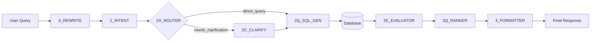

# 🤖 CECI-AI Bot Chain

> **Intelligent multi-bot system for processing Hebrew queries about Israeli government decisions**

The Bot Chain replaces the original SQL engine with a sophisticated pipeline of 7 specialized GPT-powered bots, each handling a specific aspect of query processing.

## 🏗️ Architecture Overview



## 🚀 Quick Start

### Prerequisites
- Docker & Docker Compose
- OpenAI API Key
- Supabase project (or PostgreSQL)

### 1. Environment Setup

```bash
# Clone and navigate
cd bot_chain

# Copy environment template
cp .env.example .env

# Edit with your credentials
nano .env
```

Required environment variables:
```bash
OPENAI_API_KEY=sk-your-key-here
SUPABASE_URL=https://your-project.supabase.co
SUPABASE_SERVICE_KEY=your-service-key
```

### 2. Start Services

```bash
# Start all services
docker compose up -d

# Check service health
docker compose ps

# View logs
docker compose logs -f
```

### 3. Test the System

```bash
# Run quick tests
./tests/run_bot_chain_tests.sh

# Test individual services
curl http://localhost:8010/health  # Rewrite Bot
curl http://localhost:8011/health  # Intent Bot
curl http://localhost:8012/health  # SQL Gen Bot
```

## 🧩 Bot Services

### ✍️ 0_MAIN_REWRITE_BOT (Port 8010)
**Purpose:** Text normalization and Hebrew correction
- Fixes spelling and grammar
- Normalizes entity names (e.g., "ממשלה שלושים ושבע" → "ממשלה 37")
- Model: GPT-3.5 Turbo
- Endpoint: `POST /rewrite`

### 🎯 1_MAIN_INTENT_BOT (Port 8011)
**Purpose:** Intent detection and entity extraction
- Detects user intent (search, count, specific_decision, comparison)
- Extracts entities (government_number, topic, date_range, etc.)
- Model: GPT-4 Turbo
- Endpoint: `POST /intent`

### 📊 2Q_QUERY_SQL_GEN_BOT (Port 8012)
**Purpose:** SQL query generation
- Template-based generation (90%+ coverage)
- GPT-4 fallback for complex cases
- SQL injection prevention
- Endpoint: `POST /sqlgen`

### 🔄 2X_MAIN_CTX_ROUTER_BOT (Port 8013)
**Purpose:** Context management and routing
- Status: 🚧 Planned
- Manages conversation context
- Routes to clarification when needed

### ❓ 2C_CLARIFY_CLARIFY_BOT (Port 8015)
**Purpose:** Clarification question generation
- Status: 🚧 Planned
- Generates follow-up questions for ambiguous queries

### ⭐ 2E_EVAL_EVALUATOR_BOT (Port 8014)
**Purpose:** Result evaluation and scoring
- Status: 🚧 Planned
- Quality scoring and relevance filtering

### 🏆 3Q_QUERY_RANKER_BOT (Port 8016)
**Purpose:** Result ranking
- Status: 🚧 Planned
- BM25 + GPT-based ranking

### 📝 4_MAIN_FORMATTER (Port 8017)
**Purpose:** Response formatting
- Status: 🚧 Planned
- Markdown/JSON formatting (no GPT tokens)

## 🗄️ Database Schema

The system uses PostgreSQL with Hebrew full-text search capabilities:

```sql
-- Main decisions table
government_decisions (
    id, government_number, decision_number, decision_date,
    title, content, summary, topics[], ministries[], status
)

-- Supporting tables
governments, topics, ministries
decision_topics, decision_ministries
```

Key features:
- Hebrew text normalization functions
- Full-text search indexes
- Array-based topic/ministry storage
- Government number extraction

## 🧪 Testing

### Unit Tests
```bash
# Python unit tests
cd bot_chain
python -m pytest tests/ -v --cov=common

# Individual bot tests
python -m pytest tests/test_0_main_rewrite_bot.py
python -m pytest tests/test_1_main_intent_bot.py
python -m pytest tests/test_2q_sql_gen_bot.py
```

### Integration Tests
```bash
# Quick integration tests
./tests/run_bot_chain_tests.sh -m quick

# Comprehensive tests
./tests/run_bot_chain_tests.sh -m comprehensive -v debug
```

### CI/CD Pipeline
- ✅ **Lint:** ESLint, Flake8, YAML validation
- ✅ **Unit:** Python/Node test suites
- ✅ **Contract:** OpenAPI schema validation
- ✅ **Integration:** Docker Compose E2E tests
- ✅ **Database:** PostgreSQL migration tests

## 📊 Performance & Monitoring

### Token Usage (per query)
| Bot Layer | Avg Tokens | Model |
|-----------|------------|-------|
| 0_REWRITE | 100 | GPT-3.5 |
| 1_INTENT | 130 | GPT-4 |
| 2Q_SQL_GEN | 190 | GPT-4 |
| **Total** | **≈420** | Mixed |

### Metrics
- Prometheus metrics on `/metrics` endpoints
- Grafana dashboards (with monitoring profile)
- Health checks every 30s
- Request tracing via conversation IDs

## 🛠️ Development

### Adding a New Bot

1. **Create bot directory:**
   ```bash
   mkdir bot_chain/NEW_BOT_NAME
   cd bot_chain/NEW_BOT_NAME
   ```

2. **Implement main.py:**
   ```python
   from common import setup_logging, get_config
   from fastapi import FastAPI
   
   logger = setup_logging('NEW_BOT_NAME')
   config = get_config('NEW_BOT_NAME')
   app = FastAPI(title="NEW_BOT_NAME")
   ```

3. **Add to docker-compose.yml:**
   ```yaml
   new-bot:
     build:
       context: .
       dockerfile: ./NEW_BOT_NAME/Dockerfile
     ports:
       - "8020:8020"
   ```

4. **Create tests:**
   ```bash
   # Add to tests/test_new_bot.py
   pytest tests/test_new_bot.py
   ```

### Configuration

Bot-specific configurations in `common/config.py`:
```python
"NEW_BOT_NAME": BotConfig(
    layer_name="NEW_BOT_NAME",
    port=8020,
    model="gpt-3.5-turbo",
    temperature=0.3
)
```

## 🔧 Troubleshooting

### Common Issues

**Bot services won't start:**
```bash
# Check logs
docker compose logs bot-service-name

# Verify environment
docker compose exec bot-service-name env | grep OPENAI
```

**Import errors in Python:**
```bash
# Known issue: Python modules can't start with numbers
# Workaround: Use aliases in docker-compose service names
```

**Database connection issues:**
```bash
# Check Postgres health
docker compose exec postgres pg_isready -U postgres

# Verify schema loaded
docker compose exec postgres psql -U postgres -d ceci_bot_chain -c "\dt"
```

**OpenAI API issues:**
```bash
# Test API key
curl -H "Authorization: Bearer $OPENAI_API_KEY" \
     https://api.openai.com/v1/models
```

### Performance Tuning

**Token optimization:**
- Use template-based SQL generation (reduces GPT calls by 90%)
- Cache conversation context in Redis
- Batch multiple entity extractions

**Response time:**
- Parallel bot execution where possible
- Connection pooling for database
- Request/response compression

## 📈 Status & Roadmap

### ✅ Completed (Phase 1-2)
- [x] Repository structure & CI/CD
- [x] Shared libraries (logging, config)
- [x] OpenAPI contracts
- [x] 0_REWRITE_BOT (text normalization)
- [x] 1_INTENT_BOT (intent detection)
- [x] 2Q_SQL_GEN_BOT (SQL generation)
- [x] Database schema & migrations
- [x] Docker orchestration
- [x] Test framework

### 🚧 In Progress (Phase 3-4)
- [ ] 2X_CTX_ROUTER_BOT (context management)
- [ ] 2C_CLARIFY_CLARIFY_BOT (clarification)
- [ ] 2E_EVALUATOR_BOT (result evaluation)
- [ ] 3Q_RANKER_BOT (result ranking)

### 📅 Planned (Phase 5+)
- [ ] 4_FORMATTER (response formatting)
- [ ] Full pipeline orchestration
- [ ] Advanced monitoring
- [ ] Performance optimizations

### 🚨 Known Issues
- **Python module naming:** Modules starting with numbers cause import issues
- **Template coverage:** Some edge cases may fallback to GPT
- **Hebrew processing:** Complex text normalization edge cases

## 🤝 Contributing

1. Follow existing code patterns
2. Add comprehensive tests
3. Update documentation
4. Ensure CI passes
5. Test with Hebrew text samples

## 📄 License

MIT License - see main repository LICENSE file.

---

Built with ❤️ for CECI-AI • Powered by GPT-4 & FastAPI